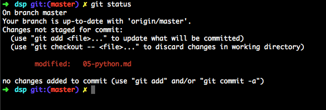
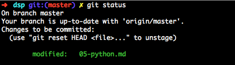
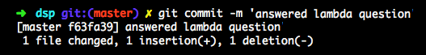
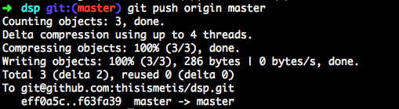

# Set up your repository on GitHub

Before you start, please take 15 minutes to [Try Git](https://try.github.io/levels/1/challenges/1). It does a great job at explaining the basic concepts, which we will be using for this part of the pre-work. 

## Step 1: Sign up for GitHub

You will need a GitHub account.

It's easy and free to [sign up](https://github.com/join).

## Step 2: Sign in to GitHub

Make sure that you are [signed in](https://github.com/login) to GitHub.

## Step 3: Fork this repository

Click the **Fork** button at the upper right hand corner of the page:

This makes a personal copy of the repository. Your forked copies will show up in your *Repositories* section.

This repository is `thisismetis/dsp`. Your forked copy will be `your_github_user_name/dsp`.

## Step 4: Clone the repository locally

This makes a copy of the repository in your laptop. Click on the clipboard image on the right sidebar to copy the HTTPS clone URL. 

Create the following folders:  

(OSX): `/Users/yourname/ds/metis/metisgh/prework`

Example: /Users/laumontemayor/ds/metis/metisgh  

(Windows): `C:/ds/metis/metisgh/prework`

Navigate in your terminal to the folder you just created. Type `git clone` and then paste the clone URL.  

`$ git clone https://github.com/your_username/dsp.git`  

Cloning the directory will create the following:

`/Users/yourname/ds/metis/metisgh/prework/dsp`

And now `cd` into the `/dsp` folder. Your terminal window should now show show something like this:

## Step 5: `add`ing, `commit`ting and `push`ing

In this step, you will be using both the terminal and your favorite text editor.  

You will learn how to complete the challenges in your text editor and then `push` them up to GitHub when you're done. We will **not** be doing any branching, merging, rebasing or any of that fun stuff (yet). GitHub is also a great way to save your work, even if you aren't done with a  challenge at a particular time.  

There is some important terminology to consider for this part before we move on.  

There are three main states that your files can reside in: 

- **Modified** means that there's been changes to the file but it's not committed yet. 

- **Staged** means that you have marked a file to go into your next commit snapshot.

- **Committed** means that the changes you made have been stored locally.

The basic workflow goes something like this:

1. Modify the files.
2. Stage the files. 
3. Do a commit. 
4. Push up to GitHub.  

There's four basic commands you should get familiar with:

`$ git add <filename>`  
`$ git commit -m "message"`  
`$ git push`  
`$ git status`  

Let's put this all together now!

**5a. `git status`**

In your local repository, edit the files for the problem statement with your solution.  

Go to your terminal. If you type `$ git status`, you should get a message like this:  

This means that you have **modified** the files that appear there. This is what is called the **staging** area. Any files you modify will appear here. 

**5b. `git add`**

If you are ready with the changes, then it's time to `git add` the files. 

You can add all files by typing `$ git add .`, or you can add one by one like above by specifying the path after `$ git add`.  

  

If you type `$ git status` again, you should get something like this:

  

As you can see, your changes are now ready to be `commit`ted. 

**5c. `git commit`**

Once you're ready to save the files, then it's time to `git commit` them.  

The message should be descriptive enough, but also short and sweet. It is strongly recommended that you commit often, as this will save your work and will help you keep track of changes easier.   

**5d. `git push`** 

Once you're done with the challenge, it's time to show your work in your remote GitHub repository. Let's `git push`.

Your work should now show up in your remote repository.

And you're done! (for now)  

You can also use this workflow to add images to your repository. All you need to do is add them to the _img_ folder, and they will be added to the staging area.   

GitHub has some great documentation, along with this really awesome [cheat sheet](https://education.github.com/git-cheat-sheet-education.pdf). 

---

### Deepen your knowledge

The process above is designed to be accessible to anyone regardless of background. There is much more to learn about `git` and GitHub.

To get a complete understanding of `git`, you should read [Pro Git](http://git-scm.com/book/en/v2). It's available free online or as a printed book.

