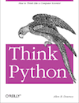

# Learn Python

Read Allen Downey's [Think Python](http://www.greenteapress.com/thinkpython/) for getting up to speed with Python 3.x and computer science topics. It's completely available online, or you can buy a physical copy if you would like.

For quick and easy interactive practice with Python, many people enjoy [Codecademy's Python track](https://www.codecademy.com/learn/learn-python). There's also [Learn Python The Hard Way](https://learnpythonthehardway.org/) and [The Python Tutorial](https://docs.python.org/3.6/tutorial/).

All Python exercises must be completed via HackerRank. Do not be afraid to google errors and bugs your encounter along the way - [StackOverflow](https://stackoverflow.com/) is your friend!

Furthermore, when completing HackerRank exercises, be sure to fire up Jupyter Notebook to test and debug code locally before posting it to HackerRank. This will be excellent practice in getting comfortable with the Jupyter Notebook environment.

