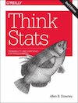
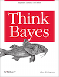

# Statistics

Read Allen Downey's [Think Stats (second edition)](http://greenteapress.com/thinkstats2/) and [Think Bayes](http://greenteapress.com/thinkbayes/) for getting up to speed with core ideas in statistics and how to approach them programmatically. Both books are completely available online, or you can buy physical copies if you would like.

[](http://greenteapress.com/thinkstats2/)
[](http://greenteapress.com/thinkbayes/)  

Complete the following exercises along with the questions in this file. They come from Think Stats, and some can be solved using code provided with the book. The preface of Think Stats [explains](http://greenteapress.com/thinkstats2/html/thinkstats2001.html#toc2) how to use the code.

Communicate the problem, how you solved it, and the solution, within each of the following [markdown](https://guides.github.com/features/mastering-markdown/) files. (You can include code blocks and images within markdown.)

---

###Required Exercises

###Q1. [Think Stats Chapter 2 Exercise 4](statistics/2-4-cohens_d.md) (Cohen's d)
###Q2. [Think Stats Chapter 3 Exercise 1](statistics/3-1-actual_biased.md) (actual vs. biased)
###Q3. [Think Stats Chapter 4 Exercise 2](statistics/4-2-random_dist.md) (a random distribution)
###Q4. [Think Stats Chapter 5 Exercise 1](statistics/5-1-blue_men.md) (blue men)
###Q5. [Think Stats Chapter 7 Exercise 1](statistics/7-1-weight_vs_age.md) (weight vs. age)
###Q6. [Think Stats Chapter 8 Exercise 2](statistics/8-2-sampling_dist.md) (sampling distribution)

###Q7. Bayesian (Elvis Presley twin)  
Elvis Presley had a twin brother who died at birth.  What is the probability that Elvis was an identical twin? Assume we observe the following probabilities in the population: fraternal twin is 1/125 and identical twin is 1/300.  

>> REPLACE THIS TEXT WITH YOUR RESPONSE

---

###Q8. Bayesian &amp; Frequentist Comparison  
How do frequentist and Bayesian statistics compare?

>> REPLACE THIS TEXT WITH YOUR RESPONSE

---

###Optional Exercises

The following exercises are optional, but we highly encourage you to complete them if you have the time.

###Q9. [Think Stats Chapter 6 Exercise 1](statistics/6-1-household_income.md) (household income)
###Q10. [Think Stats Chapter 8 Exercise 3](statistics/8-3-scoring.md) (scoring)
###Q11. [Think Stats Chapter 9 Exercise 2](statistics/9-2-resampling.md) (resampling)

Some people enjoy video content such as Khan Academy's [Probability and Statistics](https://www.khanacademy.org/math/probability) or the much longer and more in-depth Harvard [Statistics 110](https://www.youtube.com/playlist?list=PL2SOU6wwxB0uwwH80KTQ6ht66KWxbzTIo). You might also be interested in the book [Statistics Done Wrong](http://www.statisticsdonewrong.com/) or a very short [overview](http://schoolofdata.org/handbook/courses/the-math-you-need-to-start/) from School of Data.

## FAQ  

###**Q:  How do I use the code referenced in the book?**  
A:  See step-by-step instructions below.  

**Step 1. Create a directory on your computer where you will do the prework.  Below is an example:**

```
(Mac):      /Users/yourname/ds/metis/prework  
(Windows):  C:/ds/metis/prework
```

**Step 2. cd into the prework directory.  Use GitHub to pull this repo to your computer.**

```
$ git clone https://github.com/AllenDowney/ThinkStats2.git
```

**Step 3.  Put your ipython notebook or python code files in this directory (that way, it can pull the needed dependencies):**

```
(Mac):     /Users/yourname/ds/metis/prework/ThinkStats2/code  
(Windows):  C:/ds/metis/prework/ThinkStats2/code
```


